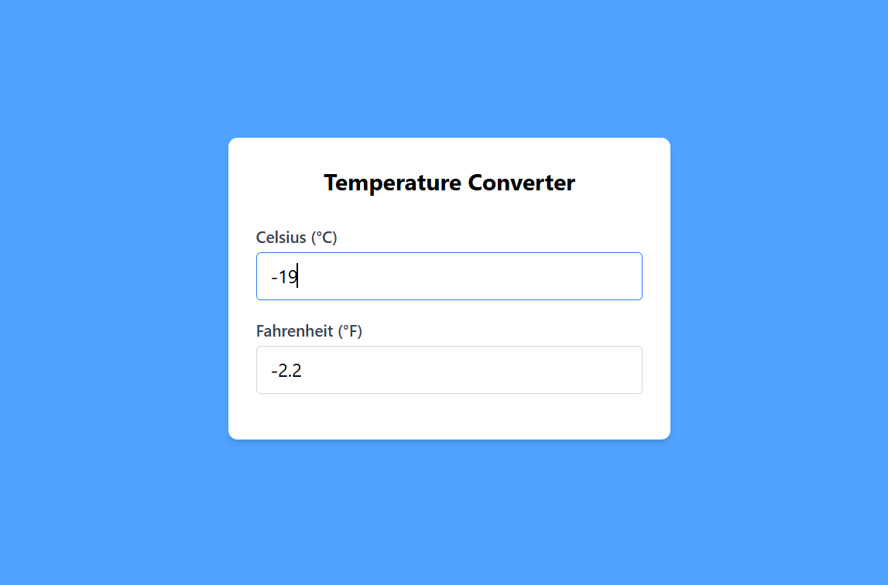

# 2.2 Temperature Converter

A bidirectional temperature conversion tool built with React and Tailwind CSS that keeps Celsius and Fahrenheit inputs synchronized in real time with dynamic background feedback.



---

## Features

- **Bidirectional Synchronization:** Typing in either input instantly converts and populates the opposing unit.
- **Precision Formatting:** All converted values are rounded to 1 decimal place.
- **Dynamic Background Colors:**
  - **Blue** (`bg-blue-200`): Below 0 °C
  - **Green** (`bg-green-200`): 0 °C to 25 °C
  - **Orange** (`bg-orange-200`): Above 25 °C
  - **Neutral Gray** (`bg-gray-100`): Default/empty/invalid state
- **Error Handling:** Detects non-numeric characters (e.g., `"abc"`), shows an error message, and prevents `NaN` values from appearing.
- **Synchronous Reset:** Clearing one field immediately clears the other and resets the background.

---

## Conversion Formulas

- **Celsius to Fahrenheit:**  
  $$F = C \times \frac{9}{5} + 32$$

- **Fahrenheit to Celsius:**  
  $$C = (F - 32) \times \frac{5}{9}$$

---

## Getting Started

### Installation

```bash
npm install
npm run dev
```
