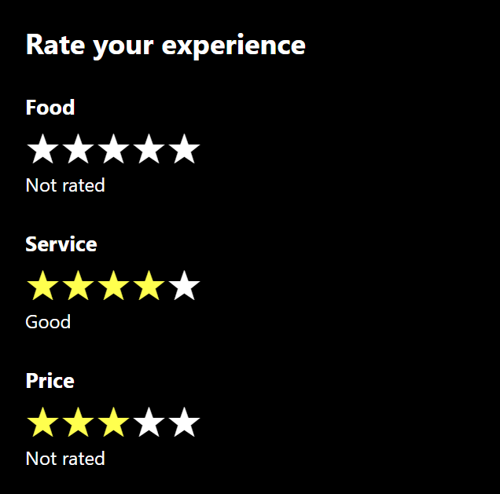

# 2.3 Star Rating

A 5-star rating control built with React and Tailwind CSS.

## Features
- Hover over a star to preview the rating (highlights that star and all before it)
- Click a star to set the rating
- Click the same star again to clear the rating
- A label shows the chosen rating: Terrible, Bad, OK, Good, Great
- The control is used 3 times (Food, Service, Price) and each works on its own

## How to run
npm install
npm run dev

## Files
- `src/StarRating.jsx` - the star rating component
- `src/App.jsx` - uses the component three times