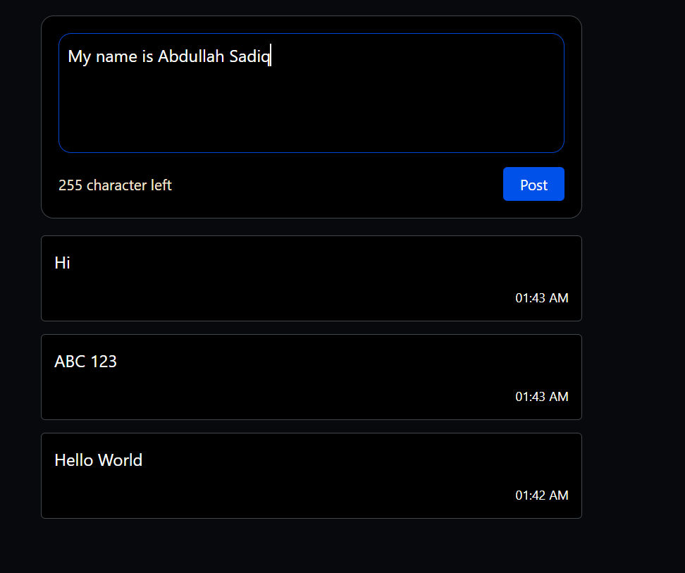

# Task 2.4: Message Composer



A lightweight, responsive short-message composer built with React and Tailwind CSS.

## Features

- **Character Limit Counter:** Tracks remaining characters out of 280.
- **Dynamic Visual Feedback:**
  - Counter turns **orange** when 20 or fewer characters remain.
  - Counter turns **red** when the limit is exceeded (< 0).
- **Validation:** Disables the Post button if the input is empty, contains only whitespace, or exceeds 280 characters.
- **Feed Ordering:** Prepends new messages to the feed so the newest message appears first.
- **Timestamps:** Displays the time each message was published.

## Project Structure

- `src/App.jsx`: Manages message state, composer inputs, validation, and post submissions.
- `src/components/MessageList.jsx`: Receives messages array via props and renders the message feed with timestamps.

## Getting Started

1. Install dependencies:
   ```bash
   npm install