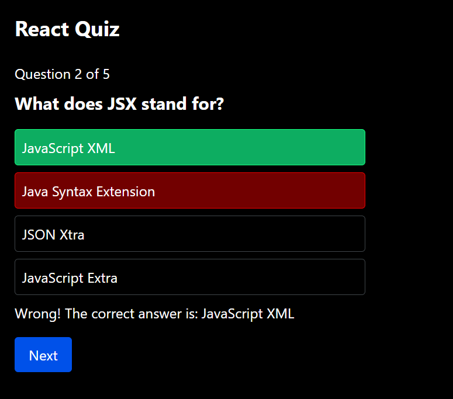

# 2.5 Quiz

A 5-question multiple-choice quiz built with React and Tailwind CSS.

## Features
- One question at a time with 4 options
- Shows if the answer was right, and the correct answer if it was wrong
- Wrong answer turns red, right answer turns green
- Answer cannot be changed after choosing
- Next button is disabled until an answer is chosen
- Progress indicator (Question 2 of 5)
- Final score (for example 3 / 5) and a Restart button

## How to run
npm install
npm run dev

## Adding a question
Add a new object in `src/questions.js`. No other code needs to change.

## Files
- `src/questions.js` - the quiz data
- `src/Quiz.jsx` - the quiz component
- `src/App.jsx` - shows the quiz