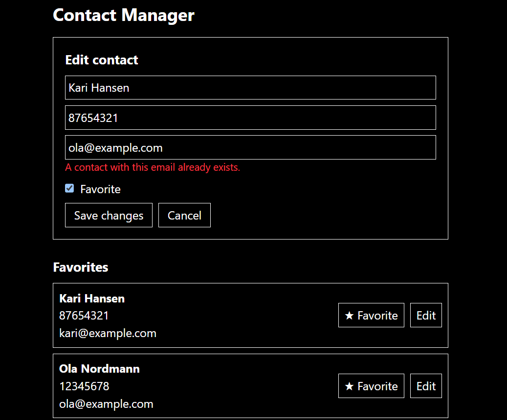

# Contact Manager

A simple contact list built with **React**, **Redux Toolkit** and **Tailwind CSS**.

One form is used for both adding a new contact and editing an existing one.



## Features

- Each contact has a name, phone number, email and a favorite flag
- Add a new contact with the form
- Click **Edit** on a contact to fill the same form (the button changes to **Save changes**)
- **Cancel** while editing clears the form and leaves the contact unchanged
- Favorites are shown first, then everyone else, each group sorted by name
- Click the star button to add or remove a favorite (the contact moves between groups)

## Validation rules

| Field | Rule                                                                |
| ----- | ------------------------------------------------------------------- |
| Name  | Required (spaces only are not accepted)                             |
| Phone | Exactly 8 digits (Norwegian format)                                 |
| Email | Must look like a valid email (`something@something.something`)      |
| Email | Must be unique. A second contact with an existing email is rejected |

When editing, a contact can keep its own email. Only another contact's email counts as a duplicate. Email comparison ignores upper/lower case.

## Tech stack

- [React](https://react.dev/) (built with [Vite](https://vite.dev/))
- [Redux Toolkit](https://redux-toolkit.js.org/) and React-Redux for state
- [Tailwind CSS](https://tailwindcss.com/) for styling

## Getting started

Requires [Node.js](https://nodejs.org/) installed.

```bash
# 1. Install dependencies
npm install

# 2. Start the development server
npm run dev
```

Then open the local address shown in the terminal (usually `http://localhost:5173`).

### Other commands

```bash
npm run build     # create a production build
npm run preview   # preview the production build
```

## Project structure

```
3.4-contact-manager/
├── public/
├── src/
│   ├── assets/
│   │   └── image.png          # Screenshot used in this README
│   ├── components/
│   │   ├── ContactForm.jsx    # One form for adding and editing, with validation
│   │   └── ContactList.jsx    # Shows favorites and others, with Edit and Favorite buttons
│   ├── slices/
│   │   └── ContactSlice.jsx   # Redux slice: addContact, updateContact, toggleFavorite
│   ├── store/
│   │   └── store.jsx          # Redux store
│   ├── App.jsx                # Remembers which contact is being edited
│   ├── main.jsx               # Starts the app and connects the Redux store
│   └── index.css              # Tailwind import
├── index.html
├── package.json
└── README.md
```

## How it works

**State (Redux).** The contact list lives in the Redux store (`slices/ContactSlice.jsx`) with three actions:

- `addContact` adds a new contact
- `updateContact` replaces the contact with the same `id`, so editing updates in place and never creates a new contact
- `toggleFavorite` flips the favorite flag

**Add or edit mode.** `App.jsx` keeps a single value, `editingContact`:

- `null` means the form is in **Add** mode
- a contact object means the form is in **Edit** mode

Clicking **Edit** in the list sets this value. `Cancel` or a successful save sets it back to `null`. The form gets a `key` based on the contact, so React builds a fresh form with the correct starting values each time the mode changes.

**Sorting.** The list is not stored sorted. `ContactList.jsx` splits contacts into favorites and others and sorts each group by name every time it renders.

**Validation.** All validation lives in one place, the `validate()` function in `ContactForm.jsx`. If there are errors, they are shown under the inputs and nothing is saved.

## How to test it

1. **Add:** add a contact with a valid phone and email. It appears in "Everyone else".
2. **Favorite:** tick Favorite when adding, or click the star on a contact. It moves to the top group.
3. **Edit in place:** click Edit, change the name and click **Save changes**. The contact is updated, not duplicated.
4. **Cancel:** click Edit, change something, then click **Cancel**. The contact is unchanged.
5. **Duplicate email:** add or edit a contact using an email that another contact already has. An error is shown.
6. **Phone:** enter a phone that is not 8 digits. An error is shown.
7. **Email:** enter `abc`. An error is shown.

## Notes

- Data is kept in memory only, so contacts reset when the page is refreshed.
- New contacts get an id from `Date.now()`, which is fine for a small project like this.
- The email check is a simple pattern, not a full email standard.
