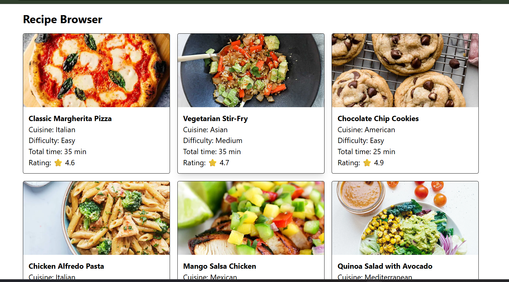

# 🍳 Recipe Browser

A clean, responsive React application built with Tailwind CSS that fetches recipes from DummyJSON and provides an interactive card grid and full detail view.



---

## ✨ Features

- **Dynamic Data Fetching**: Retrieves recipe data from `https://dummyjson.com/recipes`.
- **Responsive Card Grid**: Auto-adjusts cards across mobile, tablet, and desktop screens (`grid-cols-1 sm:grid-cols-2 md:grid-cols-3`).
- **List-Detail View Navigation**: Instant transition from recipe overview to full breakdown without external routing libraries.
- **Recipe Information**:
  - Preparation and cook time calculations
  - Cuisine and difficulty tags
  - User rating indicator
  - Step-by-step instructions and bulleted ingredient list
- **Error Handling & Retry**: Catches fetch failures and displays a retry prompt.

---

## 📁 Project Structure

```text
src/
├── assets/
│   └── image.png           # App preview / screenshot
├── components/
│   ├── RecipeCard.jsx      # Summary card displayed in grid view
│   └── RecipeDetail.jsx    # Full recipe breakdown view
├── App.jsx                 # Root component managing fetch, state, and view switching
├── index.css               # Tailwind CSS directives
└── main.jsx                # React DOM entry point
```
