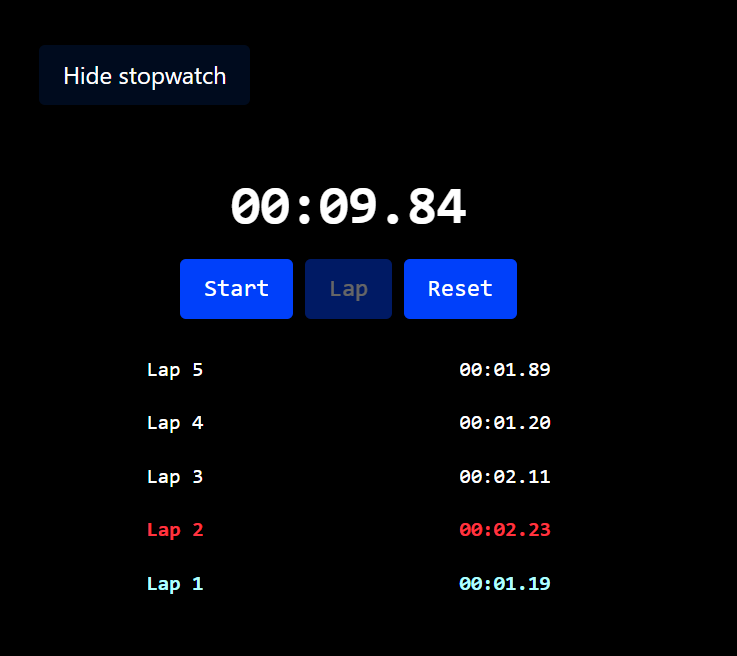

# React High-Precision Stopwatch

A lightweight, zero-drift stopwatch component built with React and Tailwind CSS. It features high-precision time tracking anchored to the real-world clock, pause/resume capability without time skew, and lap tracking with automatic best/worst lap highlighting.

---

## Preview

---

## Features

- **Drift-Free Timing:** Uses `Date.now()` differences rather than simple interval increments to guarantee real-world precision even if browser execution slows down.
- **Accurate Pause & Resume:** Employs an offset anchor calculation via `startTimeRef` to exclude paused intervals seamlessly.
- **Lap Tracking:** Measures incremental lap times using a rolling checkpoint marker (`lastLapElapsedRef`).
- **Dynamic Highlighting:** Automatically detects and colors the fastest lap (green) and slowest lap (red) once at least 3 laps have been logged.
- **Reverse Chronological Laps:** Renders the newest lap on top for immediate visibility while keeping original sequential numbers intact.

---

## Architecture & Concepts

### 1. State vs. Refs

| Identifier          | Type       | Role            | Why This Choice?                                                                                     |
| :------------------ | :--------- | :-------------- | :--------------------------------------------------------------------------------------------------- |
| `elapsed`           | `useState` | UI Display      | Stores total elapsed milliseconds. Changing it triggers a UI re-render to display the ticking clock. |
| `running`           | `useState` | Component State | Controls active/inactive state and toggles button labels.                                            |
| `laps`              | `useState` | Lap History     | Array storing completed lap durations in milliseconds (`[newest, ..., oldest]`).                     |
| `startTimeRef`      | `useRef`   | Internal Math   | Stores the shifted epoch anchor. Mutates without triggering redundant UI re-renders.                 |
| `lastLapElapsedRef` | `useRef`   | Checkpoint      | Stores the total `elapsed` time of the most recent lap trigger to compute deltas.                    |

---

## Timing & Anchor Mechanics

JavaScript timers (`setInterval`) drift over time due to event-loop delays. This component avoids drift by querying `Date.now()` on every tick:

$$\text{Display Time} = \text{Date.now()} - \text{startTimeRef.current}$$

### Pause & Resume Workflow

When resuming after a pause, the anchor (`startTimeRef`) is shifted backward by the banked `elapsed` time so the idle duration is ignored:
